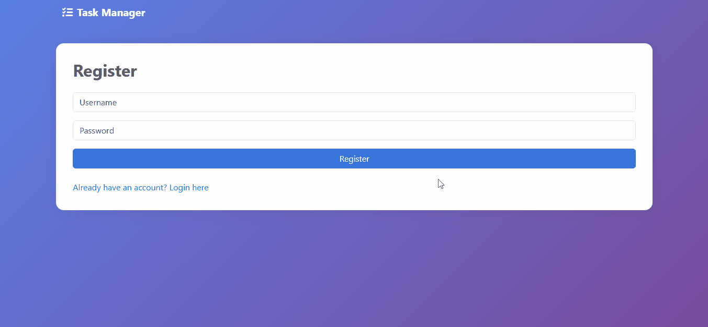

# Task Manager Application

[Source Code](https://github.com/your-repo-link)

A full-stack web application for managing tasks with authentication, prioritization, and status tracking, built using Flask and SQLite.

## Overview

This project implements a server-rendered task management system where authenticated users can create, update, and track tasks. It focuses on backend fundamentals such as user authentication, database modeling, and CRUD workflows.

## Features

- User authentication with session management
- Secure password hashing
- Create, update, delete, and view tasks
- Task prioritization (High, Medium, Low)
- Due date assignment
- Search and filter tasks
- Toggle task status (Pending / Done)

## Technical Highlights

- Server-side rendering using Jinja2 templates
- Relational data modeling with SQLAlchemy ORM
- Authentication and session handling with Flask-Login
- Separation of concerns between routes, models, and templates
- SQLite database for lightweight persistence

## Tech Stack

### Backend
- Python
- Flask
- Flask-Login
- SQLAlchemy
- Werkzeug (password hashing)

### Frontend
- HTML
- CSS
- Jinja2

### Database
- SQLite

## Setup & Run

- git clone <repo-url>
- cd task-manager
- python -m venv venv
- venv\Scripts\activate # Windows
- source venv/bin/activate # macOS/Linux
- pip install -r requirements.txt
- python app.py

## Scope & Constraints

- Server-rendered UI (no SPA or frontend framework)
- Single-user database (no multi-tenant scaling)
- No role-based access control
- SQLite used for simplicity

## Purpose

This project strengthens backend web development fundamentals:
- Authentication and authorization flows
- Persistent data modeling
- CRUD application design
- Flask application structure

## Author

Vikash Upadhyay  
GitHub: https://github.com/VikashUpadhyay442
